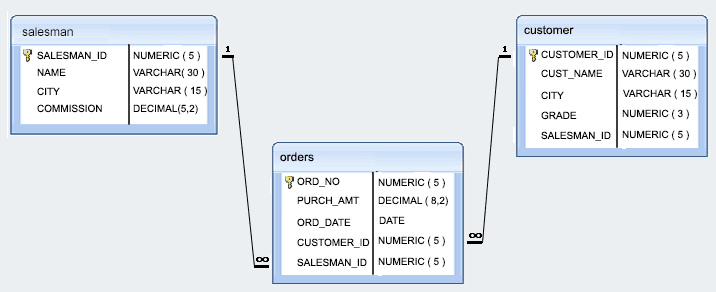

# Classe

## Pet

Écrivez une classe nommée Pet, qui doit avoir les attributs de données suivants:
* `__name` (pour le nom d'un animal domestique)
* `__animal_type` (pour le type d’animal qu’un animal de compagnie est. Les exemples de valeurs sont «Chien», «Chat»,
et «Oiseau»)
* `__age` (pour l'âge de l'animal)
La classe Pet doit avoir une méthode `__init__` qui crée ces attributs. Il devrait également avoir les méthodes suivantes:
* `set_name`
Cette méthode affecte une valeur au champ `__name`.
* `set_animal_type`
Cette méthode affecte une valeur au champ `__animal_type`.
* `set_age`
Cette méthode affecte une valeur au champ `__age`.
* `get_name`
Cette méthode renvoie la valeur du champ de `__name`.
* `get_animal_type`
Cette méthode renvoie la valeur du champ `__animal_type`.
* `get_age`
Cette méthode renvoie la valeur du champ `__age`.

Une fois que vous avez écrit la classe, écrivez un programme qui crée un objet de la classe et invite l'utilisateur à entrer le nom, le type et l'âge de son animal de compagnie. Ces données doivent être stockées en tant qu'attributs de l'objet. Utilisez les méthodes d'accès de l'objet pour récupérer le nom, le type et l'âge de l'animal et afficher ces données à l'écran.

## Car 

Écrivez une classe nommée Car qui possède les attributs de données suivants:
* `__year_model` (pour le modèle de l'année de la voiture)
* `__make` (pour la marque de la voiture)
* `__speed` (pour la vitesse actuelle de la voiture)
La classe Car doit avoir une méthode __init__ qui accepte le modèle d’année de la voiture et qui l’utilise comme arguments. Ces valeurs doivent être affectées aux attributs de données `__year_model` et `__make` de l'objet. Il doit également affecter 0 à l'attribut de données `__speed`.
La classe doit également avoir les méthodes suivantes:
* `accelerate`
La méthode d'accélération doit ajouter 5 à l'attribut de données de vitesse chaque fois qu'elle est appelée.
* `brake`
La méthode de freinage doit soustraire 5 de l'attribut de données de vitesse chaque fois qu'elle est appelée.
* `get_speed`
La méthode `get_speed` doit renvoyer la vitesse actuelle.


Ensuite, concevez un programme qui crée un objet Car, puis appelle la méthode d'accélération cinq fois. Après chaque appel à la méthode d'accélération, obtenez la vitesse actuelle de la voiture et affichez-la. Appelez ensuite la méthode de freinage cinq fois. Après chaque appel à la méthode de freinage, obtenez la vitesse actuelle de la voiture et affichez-la.

# Fichier structuré

## Feu de forêt au Brésil

Lien vers le dataset : https://www.kaggle.com/gustavomodelli/forest-fires-in-brazil

Le dataset est les données du nombre de feu de forêt au Brésil séparé par année, mois et région entre 1998 et 2007.

Voici les caractéristiques du fichier:

* Nom du fichier : amazon.csv
* Fichier CSV
* Colonnes:
  * year - Année des feux
  * state - Région des feux
  * month - Mois des feux
  * number - Le nombre de feux à l'année, le mois et la région donnée
  * date (inutilisé) - La date de l'année des deux.
* Le fichier est portugais
  * L'encodage ASCII est le `'ISO-8859-1'`
  * La présentation de nombre très grand est inhabituelle

### Travail à faire avec le fichier des feux de forêts

Notre premier programme va déterminer l'année avec le plus grand nombre de feu forêts ainsi que la région (state) qui à eu le plus de feu de forêt. Ces deux informations sont ensuite écrites dans un rapport qui prend la forme suivante :

```
Worst year : 2004 with 248928 fires.
Worst state : Mato Grosso with 767890 fires.
```

# Base de données

A partir de l'image suivante :


Tirée de [w3resource](https://www.w3resource.com/sql-exercises/).

Écrivez un programme qui construit la base de donnes suivante dans un fichier SQLite et qui va ajouter quelques salesman, orders et customer.

# Requêtes Rest

Pour cet exercice, vous devez aller consulter la documentation de l'API REST de GitHub.

* [Documentation de l'API de Github](https://docs.github.com/en/rest/reference)

Github est un service de gestion de dépots (repositories) Git pour faire le versionnage de projet avec du code de tout genre.

Comme travail, vous devez créé un programme qui va prendre le nom d'un utilisateur et faire afficher la liste des repositories disponible pour cet utilisateur. Vous devrez donc trouver la requête pour trouver la liste des "repositories" d'un "user" et de le faire afficher dans votre programme. 