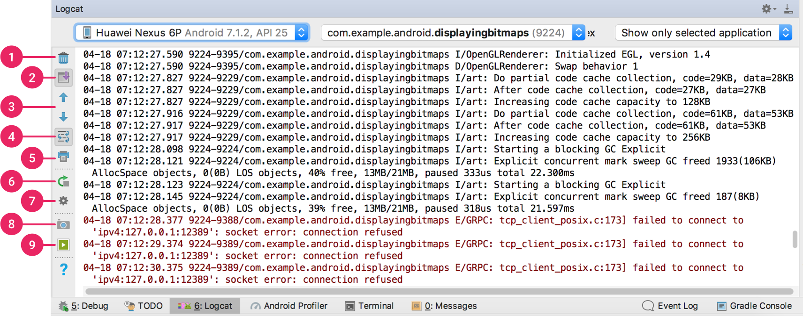

# Écrire et afficher des journaux avec Logcat

La fenêtre Logcat d'Android Studio affiche les messages système, tels que lorsqu'un garbage collection se produit, et les messages que vous avez ajoutés à votre application avec la classe `Log`. Il affiche les messages en temps réel et conserve un historique afin que vous puissiez voir les anciens messages.

## Afficher les journaux de vos applications

La fenêtre Logcat affiche les messages du journal pour l'application sélectionnée, tels que sélectionnés dans les listes déroulantes en haut de la fenêtre.

1. Effacer logcat  : cliquez pour effacer le journal visible.
Faites défiler jusqu'à la fin  : cliquez pour aller au bas du journal et voir les derniers messages du journal. Si vous cliquez ensuite sur une ligne du journal, la vue interrompt le défilement à ce stade.
2. Monter la trace de la pile  et Descendre la trace de la pile  : cliquez pour parcourir les traces de la pile dans le journal, en sélectionnant les noms de fichiers suivants (et en affichant les numéros de ligne correspondants dans l'éditeur) qui apparaissent dans les exceptions imprimées. C'est le même comportement que lorsque vous cliquez sur un nom de fichier dans le journal.
3. Utiliser des wraps souples  : cliquez pour activer le retour à la ligne et empêcher le défilement horizontal (bien que toutes les chaînes incassables nécessitent toujours un défilement horizontal).
4. Imprimer  : cliquez pour imprimer les messages logcat. Après avoir sélectionné vos préférences d'impression dans la boîte de dialogue qui apparaît, vous pouvez également choisir d'enregistrer dans un PDF.
5. Redémarrer  : cliquez pour effacer le journal et redémarrer logcat. Contrairement au bouton Effacer logcat , il récupère et affiche les messages de journal précédents, il est donc plus utile si Logcat ne répond plus et que vous ne voulez pas perdre vos messages de journal.
6. En-tête Logcat  : cliquez pour ouvrir la boîte de dialogue Configurer l'en-tête Logcat , dans laquelle vous pouvez personnaliser l'apparence de chaque message logcat, par exemple pour afficher la date et l'heure.
7. Capture d'écran  : cliquez pour capturer une capture d'écran .
8. Enregistrement d'écran  : cliquez pour enregistrer une vidéo de l'appareil (pour un maximum de 3 minutes).

## Écrire des messages de journal

La classe `Log` vous permet de créer des messages de journal qui apparaissent dans logcat. En règle générale, vous devez utiliser les méthodes de journalisation suivantes, répertoriées dans l'ordre de la priorité la plus élevée à la plus faible (ou du moins au plus détaillé):

* `Log.e(String, String)` (Erreur)
* `Log.w(String, String)` (Attention)
* `Log.i(String, String)` (information)
* `Log.d(String, String)` (déboguer)
* `Log.v(String, String)` (verbeux)

Voir la description [de la classe](https://developer.android.com/reference/android/util/Log) pour une liste plus complète des options.

Vous ne devez jamais compiler de journaux détaillés dans votre application, sauf pendant le développement. Les journaux de débogage sont compilés mais supprimés au moment de l'exécution, tandis que les journaux d'erreur, d'avertissement et d'informations sont toujours conservés.

Pour chaque méthode de journalisation, le premier paramètre doit être une balise unique et le deuxième paramètre est le message. La balise d'un message de journal système est une courte chaîne indiquant le composant système à partir duquel le message provient (par exemple, ActivityManager ). Votre balise peut être toute chaîne que vous trouvez utile, comme le nom de la classe actuelle.

## Définir le niveau de journalisation
Vous pouvez contrôler le nombre de messages qui s'affichent dans logcat en définissant le niveau de journalisation. Vous pouvez afficher tous les messages ou uniquement les messages indiquant les conditions les plus sévères.

N'oubliez pas que logcat continue de collecter tous les messages quel que soit le paramètre de niveau de journalisation. Le paramètre détermine simplement ce que logcat affiche.

Dans le menu Niveau de journal, sélectionnez l'une des valeurs suivantes:

* Verbose: affiche tous les messages du journal (valeur par défaut).
* Débogage: affichez les messages du journal de débogage qui ne sont utiles que pendant le développement, ainsi que les niveaux de message inférieurs dans cette liste.
* Info: affiche les messages de journal attendus pour une utilisation régulière, ainsi que les niveaux de message inférieurs dans cette liste.
* Avertir: affiche les problèmes possibles qui ne sont pas encore des erreurs, ainsi que les niveaux de message inférieurs dans cette liste.
* Erreur: affichez les problèmes qui ont causé des erreurs, ainsi que le niveau de message inférieur dans cette liste.
* Assert: affichez les problèmes qui, selon le développeur, ne devraient jamais se produire.

