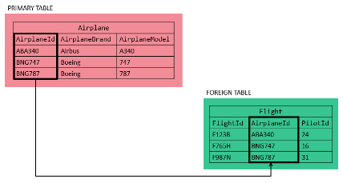

## Introduction aux systèmes de gestions de bases de données (SGBD)

Les systèmes de gestion de bases de données relationnelle (RDBMS) implémentent un logiciel permettant de faire l'enregistrement de données avec les caractéristiques suivantes :

* Les données sont structurées
* Elles sont persistantes
* Structure définie dans un schéma
* Architecture client-serveur

### Éléments d'une base de données relationnels

#### Table/Relation

L'élément principal est la table (relation). Celle-ci consiste d'un schéma (description) de différentes colonnes (attributs) qui pourront être inscrites dans la table. Elle peut aussi avoir des règles additionnelles pour des contraintes ou des caractéristiques de performances (index).

#### Ligne/Tuple/Enregistrement

Les tables reçoivent des informations sous forme de ligne (enregistrement). Ceux-ci contiennent les informations des colonnes de la table. Chaque colonne (attribut) est spécifiée dans le schéma de la table.

#### Colonne/Attribut/Champ

La table est composée de colonnes (attribut). Chaque colonne est identifiée par un nom, un type de données et d'autre spécificité (contraintes).


#### Clé primaire (Primary key `PK`)

Chaque table aura une clé primaire qui sera utilisée pour désigner chaque ligne d'une table de manière unique. La clé primaire est habituellement une colonne ou plusieurs colonnes.

#### Clé étrangère (Foreign key `FK`)

Certaines colonnes d'une table peuvent être identifiées comme clé étrangère. Ceux-ci désignent la clé primaire d'une autre table. Cette identification permet de relier les informations d'une table à une autre.



## Le langage SQL 

Pour être capable de communiquer avec un SGBDR, le langage SQL (Structured Query Langage) sera utilisé. Le langage permet d'avoir est instruction structuré qui seront effectué sur la SGBDR et leurs résultats sera renvoyé au client qui a fait la requête.

## Les niveaux du langage SQL

* DDL - Data Definition Language - Description du schéma/Création des tables
* DML - Data Manipulation Language - Manipulation des données (Sélection, insertion, mise à jour, suppression)
* DCL - Data Control Language - Gestion de l'accès (utilisateur/permission)

Nous débuterons avec la sélection de donnés (DML) et la commande `SELECT`.

## La sélection avec le `SELECT`

[Référence](https://www.postgresql.org/docs/current/sql-select.html)

Le `SELECT` permet de faire une sélection d'information sur une (et possiblement plusieurs) table. La forme générale du `SELECT` est la suivante :

```sql
SELECT
    expressions
FROM
    table_name;
```

L'évaluation débute avec le `FROM` qui détermine de quelle table on va chercher les informations. Le `SELECT` indique les expressions à aller sélectionner, habituellement des noms de colonnes sont utilisés. Si l'on veut toutes les colonnes d'une table, on remplace les expressions par `*`. Le `;` indique la fin d'une instruction SQL.

Chaque expression peut être délimitée par une virgule et avoir des opérations. À l'intérieur de scripts SQL, les `--` sont utilisé pour les commentaires.

Il est possible de renommer les expressions avec le mot clé `AS`. Cela est utile avec les expressions complexes qui utilisent plus que seulement la colonne.

### Les éléments uniques avec `DISTINCT`

Il est possible de limiter les duplicata avec le mot-clé `DISTINCT`. Celui-ci est rajouté avant les colonnes et va limiter sa sélection à des réponses uniques.

```sql
SELECT
   DISTINCT column1
FROM
   table_name;
```

### Filtrage des informations avec `WHERE`

Par défaut le `SELECT` retournent toutes les lignes d'une table. Le `WHERE` permet de filtrer des lignes d'un `SELECT`.

```sql
SELECT
    expression
FROM
    table_name
WHERE
    condition;
```

La condition est une expression qui sera évaluée pour chaque ligne résultante et qui sera gardé, la condition est vrai. Les conditions peuvent avoir une panoplie d'opérateur :

[Référence](https://www.postgresql.org/docs/14/functions-comparison.html)

| Opérateur | Description |
| -- | -- |
| `=` | égal |
| `>` | plus grand que |
| `<` | plus petit que |
| `>=` | plus grand ou égal |
| `<=` | plus petit ou égal |
| `<>` ou `!=` | différent de |
| AND | opération logique ET |
| OR | opération logique OU |
| IN | Retroune vrai si la valeur est incluse dans la liste donnée |
| BETWEEN | Retourve vrai si la valeur est entre les bornes |
| LIKE | Retourne vrai si la valeur répond au pattern |
| IS NULL | Retourne vrai si la valeur est NULL |
| NOT | Inverse le résultat logique du reste des opérations |

#### Motif (pattern matching) avec `LIKE`

L'opération `LIKE` est spéciale car elle tente de faire la détection d'un motif (pattern) dans une chaine. Deux caractère sont spéciaux : le tire-bas `_` remplace un caractère simple et le poucentage `%` remplace une séquence de zéro à une infinité de caractères.

```sql
'abc' LIKE 'abc'    -- true
'abc' LIKE 'a%'     -- true
'abc' LIKE '_b_'    -- true
'abc' LIKE 'c'      -- false
```

### Trie de résultat par le `ORDER BY`

Il est possible de trier les résultats avant l'affichage avec un `ORDER BY`. Il est ensuite possible de donné la liste des colonnes qui sera utilisé pour le trie. Les colonnes peuvent avoir l'ajout `DESC` si on veut un tri inverse.

```sql
SELECT
	select_list
FROM
	table_name
ORDER BY
	sort_expression1 [ASC | DESC],
        ...
	sort_expressionN [ASC | DESC];
```

### Fonctions d'agrégation

[Référence](https://www.postgresql.org/docs/9.5/functions-aggregate.html)

Il existe des fonctions permettant de faire l'agrégation d'information sur toutes les lignes d'une table. Les fonctions suivantes peuvent être utilisées comme expression sur une table. 

| Fonction | Description |
| -- | -- |
| avg(column) | Moyenne des valeurs |
| count(column) | Décompte du nombre de ligne |
| min(column), max(column) | Trouve la valeur min/max des lignes |
| sum(column) | La somme des valeurs des lignes |

Les fonctions d'agrégats transforment le résultat final et ne sont pas utilisables avec des expressions d'autres colonnes qui ne sont pas des fonctions d'agrégats.
